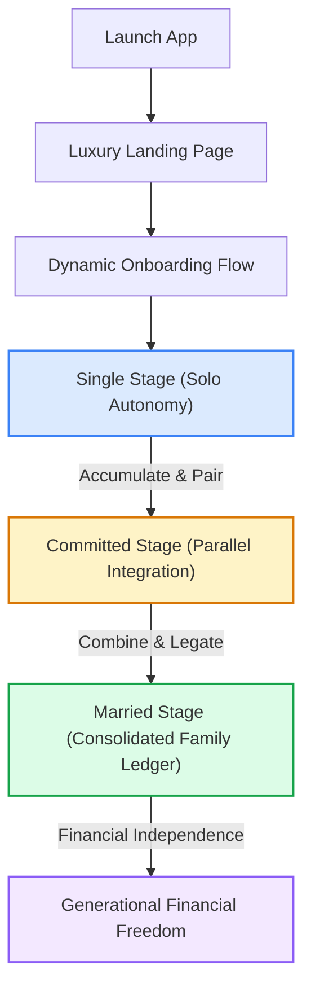

<div align="center">


<br />

<picture>
  
</picture>

<br /><br />

<!-- STATUS & QUALITY BADGES -->
<p>
  
  &nbsp;
  
  &nbsp;
  
  &nbsp;
  
</p>

<!-- TECH STACK BADGES -->
<p>
  
  &nbsp;
  
  &nbsp;
  
  &nbsp;
  
  &nbsp;
  
</p>

<br />

> **Plan Together. Grow Together. Prosper Together.**  
> *A high-fidelity, relationship-driven financial planning platform designed to evolve with individuals, committed couples, and married partners through every stage of life.*

<br />

**[🌐 Live Demo Platform](https://everbond-wealth.vercel.app)** &nbsp;·&nbsp; **[📁 Main Repository](https://github.com/arupdas0825/EverBond-Wealth)** &nbsp;·&nbsp; **[💡 Request Feature](https://github.com/arupdas0825/EverBond-Wealth/issues)**

<br />

---

</div>

## 📌 Table of Contents

- [🏢 Project Overview](#-project-overview)
- [✨ Key Highlights](#-key-highlights)
- [🧩 Detailed Features Section](#-detailed-features-section)
- [📈 Life Journey System](#-life-journey-system)
- [🔗 Partner Connection System](#-partner-connection-system)
- [🛠️ Tech Stack](#-tech-stack)
- [📁 Project Structure](#-project-structure)
- [📸 Screenshots](#-screenshots)
- [📊 Current Implementation Status](#-current-implementation-status)
- [🚀 Future Roadmap](#-future-roadmap)
- [🧠 Design Philosophy](#-design-philosophy)
- [✨ Creator Section](#-creator-section)
- [🤝 Contributing](#-contributing)
- [📄 License](#-license)

---

## 🏢 Project Overview

**EverBond Wealth** is not just another utility-based compound interest calculator. It is a highly custom, **relationship-driven financial life planning platform** designed to evolve with users organically as their real-world partnerships develop.

Standard financial software treats wealth as an isolated, numbers-only spreadsheet. **EverBond Wealth** recognizes that money and relationships are fundamentally intertwined. The platform splits the wealth journey into three major developmental stages:

1. **Single (Solo Autonomy)**: Focuses on personal wealth engineering, solo budgets, investment simulators, and private net worth mapping.
2. **Committed (Joint Dreamworks)**: Introduces parallel financial lives. Tracks personal splits, maps a custom anniversary relationship timeline, simulates downpayment savings for a first home, and initiates shared target plans.
3. **Married (Family Legacy)**: Operates a fully unified household ledger. Computes combined cash flow limits, models child trust/education compound savings, and runs systematic retirement portfolio withdrawals using the industry-standard 4% safe withdrawal rule.

By translating the financial equations of `Investment_Planner.xlsx` into a highly aesthetic, responsive, and secure React-based client interface, EverBond Wealth bridges mathematical accuracy with emotional design.

---

## ✨ Key Highlights

- 💑 **Relationship-Driven Planning**: Tailored workspaces that match the financial realities of your specific relationship stage.
- 🚀 **Dynamic Onboarding**: A luxurious, narrative-driven questionnaire that calibrates name, currency, region, salary splits, and stage automatically.
- ⚡ **Stage-Based Dashboards**: Custom interfaces that swap modules completely based on relationship status.
- 🔗 **EverBond ID Cryptographic Sync**: Private, peer-to-peer linking keys enabling partners to bind their dashboards.
- 💎 **Premium Bento Grid UI/UX**: An Apple- and Notion-inspired design architecture featuring glassmorphic layers, gold borders, and smooth micromanaged layouts.
- 🌗 **Contrast Themes**: Smooth, single-click toggle between a warm luxury light theme (Beige & Gold) and a cinematic dark theme (Deep Charcoal).
- 🧮 **Advanced Financial Simulations**: Real-time interactive SIP calculators, home fund compounders, child trust indexes, and systematic retirement charts.
- 🛡️ **Zero Cloud / Total Privacy**: Fully localized architecture. 100% of data is stored client-side in secure encrypted `localStorage` via Zustand—zero server overhead, total data ownership.
- 🌍 **Multi-Currency Display Engine**: Comprehensive international support (INR, USD, EUR, GBP, AED, SGD, CAD, CHF) mapped to dynamic regional styling rules.

---

## 🧩 Detailed Features Section

### 💎 Welcome Experience & Hero
A gorgeous 9-section scrolling product presentation page. Users are greeted by a cinematic, luxury hero section that explains the core product proposition, shows progress timelines, displays live comparison tables of stages, and introduces the project's vision before any onboarding forms are shown.

### 🚀 Dynamic Onboarding
An intuitive, step-by-step onboarding wizard. It gathers the user's name, age, income parameters, currency preference, and risk style. Depending on the selected life stage, it asks stage-specific questions (e.g., career milestones for Singles, wedding date for Committed, family objectives for Married).

### ⚡ Single Journey Dashboard
Designed with a theme of **confidence, personal ambition, and independence**:
- **Personal Net Worth Metrics**: Track individual assets.
- **Income Allocation Overview**: Dynamic visual chart of dynamic needs (50-60%), emergency savings (10%), and investment corpus (30-40%).
- **Investment Simulator Widget**: Fast slider-based compound returns projection.
- **Career Growth Milestone Tracker**: Plot future salary increases and promotional targets.
- **Future Journey Previews**: Elegant blur-locked cards showcasing the locked Committed and Married dashboards to motivate the next milestone.

### 💑 Committed Journey Dashboard
Designed with a theme of **shared dreams, future alignment, and connection**:
- **Parallel Salaries & Shared Core**: Visualizes both partners' cash flows and combined contributions.
- **Relationship Timeline**: Displays anniversaries and major shared milestones.
- **Future Home Fund Compounder**: Real-time projection of downpayments for a home.
- **Marriage Planning Calculator**: Simulates budgets, savings targets, and monthly savings splits for wedding expenses.
- **Partner Sync Status Card**: Dynamic card showing if the user's partner is connected via their EverBond ID.

### 💍 Married Journey Dashboard
Designed with a theme of **family legacy, generational safety, and unified growth**:
- **Consolidated Net Worth Index**: Fully merged asset lists.
- **Child Trust & Education Fund**: A compound-growth calculator that shows target numbers based on age and years until university.
- **Systematic Retirement Withdrawal (4% Rule)**: Employs safe withdrawal calculations to project how long a combined retirement corpus will last at different withdrawal volumes.
- **Unified Budget Ledger**: Tracks combined essential costs, monthly surplus allocation, and long-term security pools.

### 🔗 Partner Connection System
- Generates a unique, copyable client key in the format `EB-[A-Z0-9]{6}` (e.g., `EB-A7K92X`).
- Provides clean inputs to link a partner's ID, transitioning the workspace from `Not Connected` to `Connected`.
- Prepares state boundaries to coordinate shared calculations once cloud-sync functions are toggled.

### ⚙️ Premium Settings Center
An Apple-inspired Bento control panel that offers comprehensive account management:
- **Profile Customization**: Edit name, select profile avatar icons, and view copyable EverBond IDs.
- **Relationship Calibration**: View verification status, connect/disconnect partners, and edit anniversaries.
- **Preferences Center**: Update currency formats, change financial risk levels (Conservative, Balanced, Aggressive) that instantly recalculate all dynamic calculators.
- **Visual Styles**: Dynamic theme selectors to toggle Beige Warm Light and Deep Charcoal Dark styles.
- **Data Portability Hub**: 
  - **Export System**: Download the entire Zustand state as a single JSON backup.
  - **Restore System**: Drag-and-drop or upload a backup JSON to instantly recover all calculations and settings.
- **Danger Zone**: Custom-designed Framer Motion confirmation dialog modals to securely execute factory resets, onboarding clears, or cash flow reinstates.

---

## 📈 Life Journey System

The core mechanics of EverBond Wealth are structured as a linear, additive pathway. Financial inputs and personal goals scale upward as users transition through the stages of life.



### The Progression Model
1. **Solo Foundation**: Establish solid habits. Maximum investment percentage is configured under aggressive/balanced personal options.
2. **Parallel Planning**: Add dual-salaries. Funds are split based on contribution ratios. Visualizes joint dreams while maintaining private financial sovereignty.
3. **Consolidated Family Legacies**: Fully unified budgets. The asset ledger is merged, child trust plans are generated, and joint long-term retirement run rates are calculated.

---

## 🔗 Partner Connection System

The Partner Connection System uses a client-side cryptographic hashing layout designed for ultimate data sovereignty.

```
                    Partner A                                    Partner B
          ┌──────────────────────────┐                 ┌──────────────────────────┐
          │  ID: EB-A7K92X           │                 │  ID: EB-Z4N81Y           │
          │  Status: Single          │                 │  Status: Single          │
          └─────────────┬────────────┘                 └─────────────┬────────────┘
                        │                                            │
                        │            1. Input Partner B ID           │
                        ├───────────────────────────────────────────→│
                        │                                            │
                        │            2. Accept Association           │
                        │←───────────────────────────────────────────┤
                        │                                            │
                        ▼                                            ▼
          ┌──────────────────────────┐                 ┌──────────────────────────┐
          │  Status: Committed       │                 │  Status: Committed       │
          │  Verification: Connected │                 │  Verification: Connected │
          │  Shared Workspace Active │                 │  Shared Workspace Active │
          └──────────────────────────┘                 └──────────────────────────┘
```

> [!NOTE]
> The current connection flow acts as a fully modeled visual interface. It simulates local authentication handshakes, and all matching relationship properties are hydrated into the local Zustand store. A production-ready live peer connection (WebRTC/Supabase Sync) is mapped directly into Phase 2 of the roadmap.

---

## 🛠️ Tech Stack

EverBond Wealth is built using a modern, reactive, ultra-lightweight frontend stack that prioritizes rendering performance, smooth animations, and solid code architecture.

| Stack Layer | Technology Used | Rationale |
| :--- | :--- | :--- |
| **UI Library** | **React (v19.2.5)** | Declares modular, state-driven user interfaces. Takes advantage of React 19's optimized rendering behaviors. |
| **Build System** | **Vite (v8.0.10)** | Provides near-instantaneous Hot Module Replacement (HMR) and highly efficient production asset bundlers. |
| **State Storage** | **Zustand (v5.0.12)** | A lightweight state container. Employs the `persist` middleware to synchronize and retrieve dashboard progress from `localStorage` seamlessly. |
| **Animations** | **Framer Motion (v12.38.0)** | Powers premium layout shifts, dynamic card transitions, smooth drawer menus, and custom modal alert pop-ups. |
| **Data Viz** | **Recharts (v3.8.1)** | Renders highly customizable, responsive Area, Pie, and Bar charts matching the platform's color palette. |
| **Typography** | **Google Fonts** | Features the display font **Cormorant Garamond** (for an elegant, editorial feel) and **Outfit / DM Sans** (for clean body text). |
| **Icons** | **Lucide React (v1.14.0)** | Supplies sharp, scalable vector line icons. |
| **Styling** | **Custom CSS System** | Over 600 lines of highly optimized, modular CSS containing complete HSL design tokens, responsive layout rules, glassmorphism templates, and animations. Avoids bulky utility frameworks for direct render execution. |

---

## 📁 Project Structure

```
everbond-wealth/
├── .github/
│   └── workflows/
│       └── deploy.yml            # CI/CD pipeline automation for production deployment
├── src/
│   ├── assets/                   # High-fidelity image resources, illustrations, and icons
│   ├── components/               # Platform visual components
│   │   ├── allocation/           # Excel-mirrored investment category allocations (6 modules)
│   │   ├── common/               # UI design elements (buttons, inputs, premium cards)
│   │   ├── dashboard/            # Stage-tailored workspace dashboards (Single, Committed, Married)
│   │   ├── goals/                # Financial goal planners and dream lists
│   │   ├── income/               # Dynamic income adjusters and live currency calculators
│   │   ├── layout/               # Navigation sidebars, mobile layout widgets, and user headers
│   │   ├── milestones/           # Timeline and growth progress trackers
│   │   ├── settings/             # 9-section Bento Settings Center with modals
│   │   ├── simulation/           # Interactive compound SIP wealth projecting tools
│   │   └── welcome/              # 9-section luxury scrolling Landing Page and onboarding flows
│   ├── constants/
│   │   └── presets.js            # ⭐ Presets (Allocation rules, risk profiles, system currencies)
│   ├── store/
│   │   └── useFinanceStore.js    # ⭐ Global Zustand store (holds all persistent states)
│   ├── theme/
│   │   └── tokens.js             # Styling colors (Gold, Deep Charcoal, Emerald, Amber, Rose)
│   ├── utils/
│   │   ├── finance.js            # ⭐ Financial math models (SIP engines, home funds, 4% compounders)
│   │   └── milestones.js         # Life stage transition conditions and metrics
│   ├── App.jsx                   # Central page router, frame structure, and layout coordinator
│   ├── index.css                 # Platform design system containing complete variable definitions
│   └── main.jsx                  # Entry point bootstrapping the React virtual DOM tree
├── index.html                    # Root HTML document optimized with responsive viewport rules
├── package.json                  # Dynamic system dependencies and build configuration settings
├── vercel.json                   # Host configurations optimized for Vercel Edge networks
└── vite.config.js                # Core configuration for the Vite bundler pipeline
```

---

## 📸 Screenshots

### 🌅 Premium Landing Page (Hero)

*A high-end, SaaS-style scrolling presentation introduces EverBond Wealth before onboarding begins.*

### 🚀 Welcome & Stage Selection

*Interactive selection screen tailored to the user's current life chapter.*

### 📊 Consolidated Dashboard (Married Stage)

*Fully loaded dashboard displaying unified salaries, dual allocations, and compound charts.*

### 💎 Detailed Investment Allocations

*Exact mathematical translations of essential, debt, equity, gold, and crypto splits.*

### 📈 Future Wealth Simulator

*Adjustable parameters to forecast 30-year net worth projection curves.*

### ⚙️ Apple-style Settings Center

*9 Bento-grid settings cards displaying Profile, Risk options, Cloud JSON exports, and Danger Zones.*

### 📱 iOS-optimized Mobile Dashboard
<div align="center">
  
</div>

---

## 📊 Current Implementation Status

EverBond Wealth is fully operational. All core layout features, responsive styling elements, calculation scripts, and interactive tools are complete.

| Feature Segment | Module Status | Detail |
| :--- | :---: | :--- |
| **Landing Presentation** | 🟢 **100% Complete** | 9-section scrolling page, animated stage timelines, pricing comparisons, and creators section. |
| **Onboarding Pipeline** | 🟢 **100% Complete** | Contextual forms for Single, Committed, and Married onboarding inputs. |
| **Zustand Engine Store** | 🟢 **100% Complete** | Dynamic state management utilizing `localStorage` persistence and multi-currency formatting. |
| **Single Workspace** | 🟢 **100% Complete** | Interactive SIP growth model, career targets list, and future dashboard previews. |
| **Committed Workspace** | 🟢 **100% Complete** | Dual-salary displays, anniversary milestones, Home Fund projections, and wedding planners. |
| **Married Workspace** | 🟢 **100% Complete** | Family net worth ledgers, Child Trust trackers, and systematic retirement withdrawal simulators. |
| **Bento Settings Center** | 🟢 **100% Complete** | Interactive profile forms, copyable keys, risk parameters, JSON backups, and Danger Zone confirmation alerts. |
| **FX Conversion Module** | 🟢 **100% Complete** | Real-time currency conversions using fallback currency tables. |
| **Responsive Aesthetics** | 🟢 **100% Complete** | Mobile layouts including an elegant, floating glassmorphic bottom navigation pill. |

---

## 🚀 Future Roadmap

```
  Phase 1: Frontend Foundation   ───→   Phase 2: Cloud Sync & Auth   ───→   Phase 3: Relationship Verification
       (Current Release)                  (Planned Fall 2026)                  (Planned Winter 2026)
                                                                                          │
                                                                                          ▼
  Phase 5: Complete Wealth Ecosystem  ←───  Phase 4: AI Insights Engine ◄─────────────────┘
         (Planned 2027)                      (Planned Spring 2027)
```

### Phase 1: Frontend Foundation (Current Release)
- [x] Apple-style glassmorphic user layouts.
- [x] Comprehensive stage-based dynamic dashboards.
- [x] Accurate mathematical translations of `Investment_Planner.xlsx` models.
- [x] Portable client-side JSON backups and restore options.

### Phase 2: Cloud Sync & Backend Infrastructure (Planned Fall 2026)
- **Supabase Integration**: Live database indexing for instant cross-device updates.
- **Secure Authentication**: Multi-factor authentication layouts (email, Google, Apple ID).
- **Live Peer Syncing**: Dynamic WebRTC-based sharing to synchronize partner inputs automatically across different devices.

### Phase 3: Relationship Verification (Planned Winter 2026)
- **Partner Handshake**: Double-key authentication to verify partner connection requests securely.
- **Selfie Verification**: Multi-step identity matches using biometric verification patterns.
- **Relationship Badges**: Custom verified profile indicators that unlock premium shared vault features.

### Phase 4: AI Insights Engine (Planned Spring 2027)
- **AI Financial Advisor**: Trained models that analyze salary cash flows, dynamic allocations, and savings deficits.
- **Personalized Recommendations**: Contextual financial tips tailored to your specific life stage (e.g., child savings plans, home deposit calculations).

### Phase 5: Advanced Wealth Ecosystem (Planned 2027)
- **Shared Financial Vault**: A secure vault to upload essential household documents (leases, deeds, insurance).
- **PDF Report Generator**: Create beautiful, presentation-ready wealth portfolio summaries.
- **Smart Notifications**: Reminders for anniversaries, savings goals, and re-allocations.

---

## 🧠 Design Philosophy

EverBond Wealth is built around a simple core premise: **Financial software should feel premium, accessible, and emotionally resonant.**

We reject standard, uninspiring spreadsheet styles and generic green-and-white layouts in favor of an **editorial, editorial-style luxury experience**:
- **Harmonious Warmth**: Built using soft cream backdrops (`#FAF9F6`), rich gold accents (`#C9A84C`), and deep charcoal highlights (`#1A1714`) to evoke premium quality.
- **Contextual Context**: Locked views and previews of future milestones encourage couples to discuss, plan, and progress through life chapters together.
- **Zero Friction**: Eliminate usernames, passwords, and databases for the onboarding MVP. Instant start, instant calculation, absolute privacy.

---

## ✨ Creator Section

<div align="center">

### **Arup Das**
**Frontend Developer · UI/UX Enthusiast · Future Fintech Builder**

Arup Das created EverBond Wealth to bridge professional wealth calculations with a modern, elegant user experience. He is dedicated to building highly functional, aesthetically striking web applications that solve real-world problems.

[💼 Portfolio website](https://github.com/arupdas0825) &nbsp;·&nbsp; [✉️ Contact Arup](mailto:arupdas.dev@gmail.com)

*“EverBond Wealth represents a vision of personal finance that values relationships as highly as numbers. It is built to help couples grow closer by growing their wealth together.”*

</div>

---

## 🤝 Contributing

We welcome contributions to EverBond Wealth! To get involved:

1. **Fork** the repository to your own account.
2. **Create a Branch** for your feature or fix:
   ```bash
   git checkout -b feature/your-awesome-feature
   ```
3. **Commit** your changes with clear, descriptive messages:
   ```bash
   git commit -m "feat: add beautiful dark mode chart tooltip"
   ```
4. **Push** to your branch:
   ```bash
   git push origin feature/your-awesome-feature
   ```
5. **Open a Pull Request** describing your changes and testing process.

---

## 📄 License

This project is licensed under the **MIT License** - see the [LICENSE](LICENSE) file for details.

---

<div align="center">


<br />

**Designed with 💑 for couples building their future together.**  
<sub>EverBond Wealth · Powered by Excel Intelligence · Deployed on Vercel Edge</sub>

</div>
